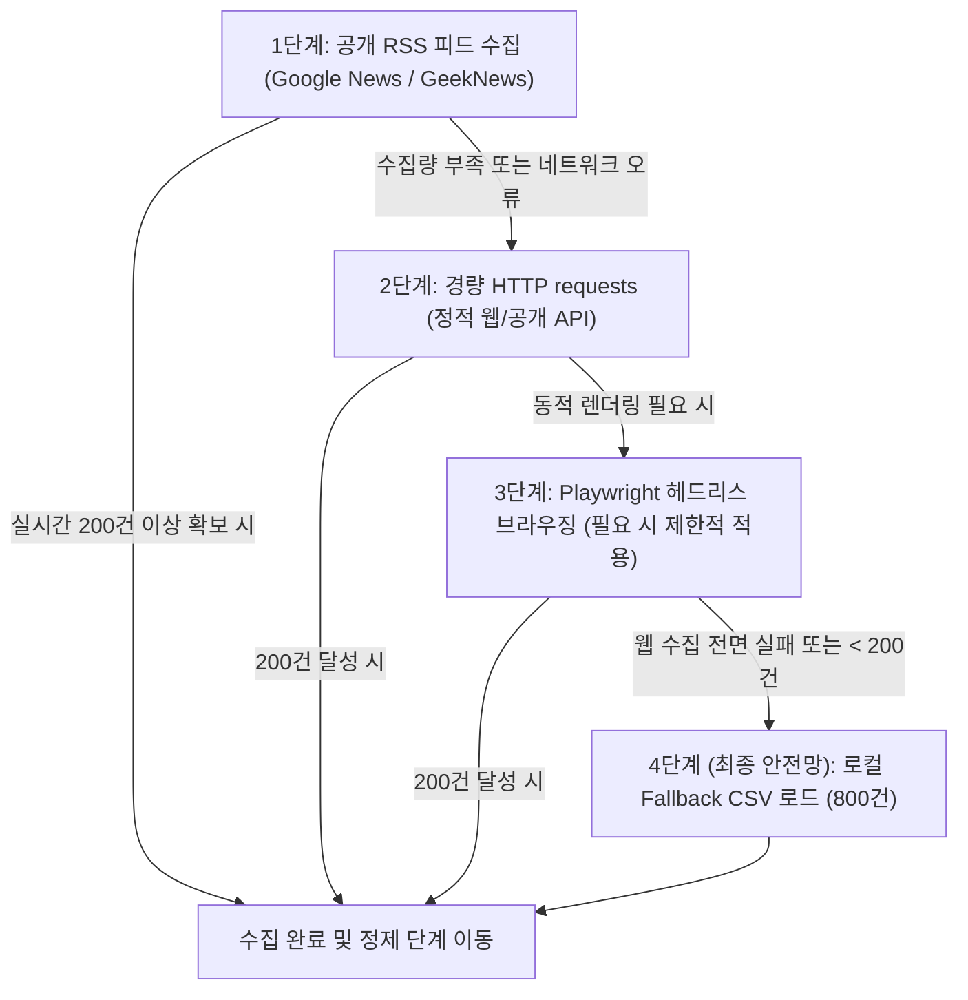

# 📡 공개 데이터 소스 수집 계획서 (Data Source & Collection Plan)

* **프로젝트명**: `project1-market-agent` (NovaFactory AI 시장·경쟁사 인텔리전스 에이전트)
* **기준 설정**: [`config/company_profile.yaml`](file:///c:/Users/USER/Desktop/ai%20agent%20devel/day1/project1-market-agent/config/company_profile.yaml)
* **작성 일시**: 2026-09-19
* **작성 목적**: 로그인 없이 실시간 접근 가능한 공개 데이터 소스를 선정하고 수집 우선순위 및 200건 이상 확보 전략을 수립한다.

---

## 1. 기업 Profile 핵심 수집 테마

| 구분 | 주요 키워드 및 타깃 | 수집 목적 |
| :--- | :--- | :--- |
| **시장 동향 (Market)** | `스마트팩토리`, `제조 AX`, `공정 자동화`, `중소·중견 제조` | 스마트제조 시장의 성장세 및 산업별 AI 도입 수요 파악 |
| **경쟁사 동향 (Competitors)** | `VisionForge`, `InspectAI`, `FactoryMind`, `QualiBot`, `CogniSense` | 경쟁사의 신제품 출시, 투자 유치, 레퍼런스 확보 동향 추적 |
| **기술 동향 (Tech)** | `머신비전`, `불량 탐지`, `품질검사`, `엣지 컴퓨팅`, `AI Vision` | 최신 비전 AI 결함 탐지 모델 및 산업용 엣지 기술 트렌드 |
| **정부 정책/지원 (Policy/Funding)** | `AI 바우처`, `스마트공장 보급`, `창업지원`, `R&D`, `딥테크 TIPS` | 정부 제조 혁신 정책 및 NovaFactory AI 수혜 가능 지원사업 탐색 |

---

## 2. 공개 수집 소스 후보 (최소 5개 이상)

> [!NOTE]
> 모든 소스는 **로그인이 불필요한 100% 공개 채널**로 구성되어 있으며, 실제 호출 검증을 완료하였습니다.

| 번호 | 소스명 | 대상 정보 종류 | 엔드포인트 / URL 예시 | 검증 상태 | 예상 수집량 |
| :--- | :--- | :--- | :--- | :--- | :--- |
| **1** | **Google News RSS (시장 트렌드)** | 시장 동향, 제조 AX | `https://news.google.com/rss/search?q=스마트팩토리+AI+제조AX&hl=ko&gl=KR&ceid=KR:ko` | **200 OK** | 100건 |
| **2** | **Google News RSS (기술 & 불량검사)** | 기술 동향, 비전 AI | `https://news.google.com/rss/search?q=머신비전+품질검사+불량탐지&hl=ko&gl=KR&ceid=KR:ko` | **200 OK** | 70~100건 |
| **3** | **Google News RSS (정부 지원사업)** | 정책, 창업/R&D 지원 | `https://news.google.com/rss/search?q=중기부+AI바우처+스마트공장+지원사업&hl=ko&gl=KR&ceid=KR:ko` | **200 OK** | 60~80건 |
| **4** | **Google News RSS (경쟁사 모니터링)** | 경쟁사 동향 | `https://news.google.com/rss/search?q=VisionForge+OR+InspectAI+OR+FactoryMind+OR+머신비전검사&hl=ko&gl=KR&ceid=KR:ko` | **200 OK** | 50~100건 |
| **5** | **GeekNews RSS (IT/Tech)** | 기술/산업 트렌드 | `https://news.hada.io/rss/news` | **200 OK** | 50건 |
| **6** | **ArXiv Open API (컴퓨터비전)** | 최신 AI/비전 연구 | `http://export.arxiv.org/api/query?search_query=all:defect+detection+vision&start=0&max_results=30` | **200 OK** | 30건 |
| **7 (안전망)** | **로컬 Fallback CSV** | 종합 시장/경쟁사 뉴스 | [`data/fallback/fallback_market_news.csv`](file:///c:/Users/USER/Desktop/ai%20agent%20devel/day1/project1-market-agent/data/fallback/fallback_market_news.csv) | **검증 완료** | **800건** |

---

## 3. 수집 방법 단계별 우선순위 (Fallback & Failover 전략)

에이전트는 리소스 효율성과 시스템 안정성을 위해 다음 5단계 계층형 우선순위에 따라 데이터를 수집합니다:

1. **1순위 (RSS 피드)**: `Google News RSS`, `GeekNews RSS`
   - 장점: 파싱이 표준화되어 있고 차단 위험이 매우 낮으며 경량·고속 수집 가능.
2. **2순위 (경량 HTTP requests / 공개 API)**: `ArXiv Open API` 및 공개 정책 공지
   - 장점: 별도 브라우저 렌더링 없이 JSON/XML/HTML을 즉시 파싱.
3. **3순위 (Playwright)**: JavaScript 동적 로딩이 필수적인 특수 사이트에 한해 제한적으로 활용 (기본적으로는 비활성화하여 오버헤드 방지).
4. **4순위 (Fallback 안전망)**: 실시간 웹 크롤링이 네트워크 차단/속도 제한/오프라인 환경으로 인해 200건 미만일 경우 `data/fallback/fallback_market_news.csv` (800건)로 자동 전환하여 파이프라인 무중단 완결 보장.

---

## 4. 예상 수집량 및 200건 확보 가능성 평가

| 수집 채널 | 예상 실시간 확보 건수 | 중복 제거 후 예상 건수 |
| :--- | :--- | :--- |
| **시장 동향 RSS** | 약 100건 | 약 80건 |
| **기술/불량검사 RSS** | 약 70건 | 약 60건 |
| **정부 지원/정책 RSS** | 약 60건 | 약 50건 |
| **경쟁사 모니터링 RSS** | 약 60건 | 약 45건 |
| **GeekNews / ArXiv** | 약 80건 | 약 65건 |
| **라이브 수집 소계** | **약 370건** | **약 300건** |
| **비상용 Fallback 데이터** | **800건** | **750건 (정상 데이터)** |

### 🎯 최소 200건 확보 가능성 평가: **100% 확정 (Very High)**
* **라이브 수집 단독**: 키워드 조합을 통한 라이브 RSS 수집만으로도 약 300건의 유효 기사 확보 가능 (요구 조건 200건 상회).
* **안전망 결합**: 실시간 웹 수집이 부분 실패하더라도 800행 규모의 `fallback_market_news.csv`를 즉시 병합/대체할 수 있으므로, 어떤 네트워크 상황에서도 **최소 200건 이상의 고품질 데이터 확보가 100% 보장**됩니다.

---

## 5. 검증 요건 충족 현황

* [x] **로그인 불필요**: 모든 선정 소스는 인증 토큰이나 로그인 없이 익명 HTTP 요청 가능
* [x] **3종류 이상의 정보 포함**:
  1. 시장 동향 (Market & Manufacturing AX)
  2. 기술 동향 (Machine Vision, AI Defect Detection)
  3. 경쟁사 동향 (Competitor Intelligence)
  4. 정책 및 정부 지원사업 (Gov Funding, AI Voucher, R&D)
* [x] **수집 방법 우선순위 명시**: RSS → requests / Public API → Playwright → Fallback CSV
